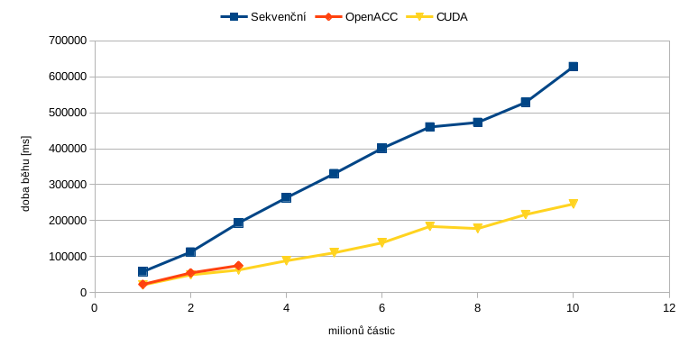

# The N-body Problem
## Definice problému
Ve fyzice a astronomii, N-Body simulace je simulace dynamického systému částic, které podléhají nějakým fyzických silám jako je například gravitace. Tyto simulace se používají například ke studování evoluce sluneční soustavy.
## Sekvenční řešení
K sekvenčnímu řešení jsme nejprve přistupovaly naivně, tedy vytvořili jsme si jednotlivé částice a počítali jsme vliv každé častice na každou ostatní částici. Toto řešení je sice jednoduché lehce se paralelizuje, ale pokud máme miliony částic, tak je pomalu nemyslitelné toto spočítat v rozumném čase. Proto jsme použili Barnes-Hut algoritmus, který clustruje body do jednotlivých uzlů a poto mse nepočítá s jednotlivou částicí, ale se středem massy celého clustru.

Tento sekvenční algoritmus jsme následně zmeřili na instancích od jednoho milionu částit až po deset milionů částic. Měření proběhlo na CPU: Intel(R) Core(TM) i7-8700K CPU @ 3.70GHz(12 jader).
## OpenACC
U OpenACC jsme narazili na první problémy a to s naší reprezentací octo-tree u Barnes-Huta. Museli jsme tedy většinu našeho základního kódu přepsat abychom naše datové struktury mohlo lehce serializovat a deserializovat, kvůli přesunu na paměť grafické karty. Po mnoho trápení se nám podařilo tento program zkompilovat a spustit se smysluplnými výsledeky.

Rychlost programu byla mnohonásobně lepší jak u naší CUDA implementace, ale při vetších instancí, které obsahovaly čtyři miliony a více částic, náš program padal na nedostatek paměti. Proto máme časy pouze na instancích od jednoho až do čtyř milionů částic.
## CUDA
Stejně jak u OpenACC, to že jsme se snažili napsat program tak aby byl čitelný a dal se lehce v budoucnosti rozvýjet dále. Takto tyto všechny faktory opět hrály proti nám.

Naše řešení vypadá následovně: Na grafický akcelerátor kopírujeme struktury k výpočtu octo-tree, ketrý je serializovaný do tabulky, poté pomocné pole s pozicema částit v tabulce a nakonec pole, které obsahuje inforamce o částicích. Počet vláken v bloku vypočítaváme jako `(počet částic -1) / 1024 + 1` a počet bloků je roven číslu `min(nOfParticles, 1024)` . S těmito prametry poté voláme proceduru, které se vykonává na grafickém akcelerátoru a vypočítáváme jednotlivé síly působící na jednotlivé částice. Následně synchronizujeme zařízení a provedeme ještě paralelně posun částic o výše vypočítané síly a opět synchronizujeme zařízení. Samozřejmě na konci bloku uvolníme alokovanou pamět na grafické kartě.
## Shrnutí výsledků
Měření probíhalo na serveru star na grafickým akcelerátoru nVidia Tesla a lokálně na procesoru Intel Core i7-8700K.

### Graf časů v závilosti na velikosti instance

Z naměřených výsledků lze vidět že OpenACC je nejrychlejší, ale z důvodů vysoké paměťové náročnosti, jsme nedokázali změřit více výsledků. CUDA řešení je sice rychlejší, ale né o tolik oproti sekvenčnímu řešení. Je to z důvodů vysoké časové řežie při vytváření octo-tree a počítání středů jednotlivých clusterů.

## Závěr
Závěrem bychom chtěli říct, že jsme si vědomi že naše výsledky nejsou úplně optimální, ale víme jak bychom je mohli napravit. Jedná se hlavně o paralelizaci výtváření a počítání středů v octo-tree. Která je nezbytná pro algoritmus Barnes-Hut. Cílem toho předmětu ale není vytvořit nejoptimálnější CUDA řešení pro N-Body problém, ale vyzkoušet si jednotlivé druhy paralelizace na grafickým akcelerátoru a zjistit co to obnáší za nástrahy. Timto si myslíme, že jsme cíl tohoto předmětu splnili.

## Literatura
[1]	J.Barnes,	P.	Hut,	A	hierarchical	O(n log n)	force-calculation	algorithm,	Nature,	324	(4)	(1986)	446-449

[2]	A	 practical	 comparison	 of	 N-body	 Algorithms- Guy	 Blelloch	 and	 Girija	 Narlikar-Parallel	 Algorithms,	
Series	in	Discrete	Mathematics	and	Theoretical	Computer	Science,	volume	30,	1997

[3]	http://http.developer.nvidia.com/GPUGems3/gpugems3_ch31.html

[4]	http://www.cs.nyu.edu/courses/spring12/CSCI-GA.3033-012/nbody-problem.pdf
